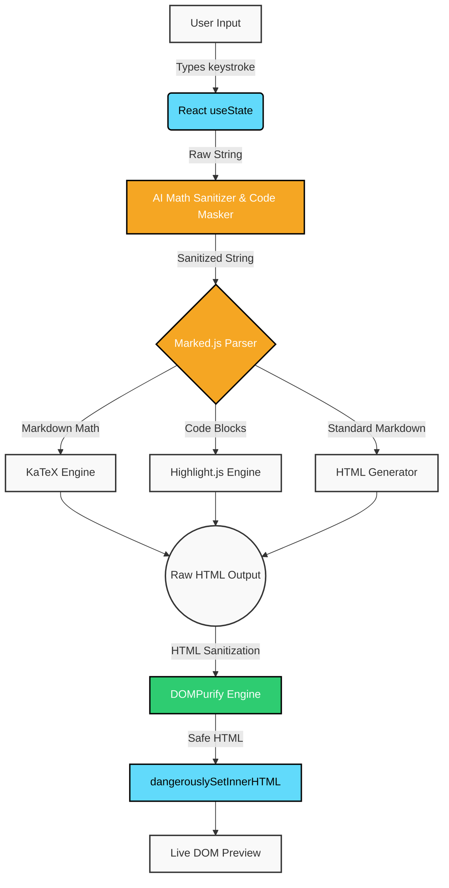

# MARKDOWN LATEX PDF GENERATOR
*A minimal web app to preview Markdown and LaTeX math instantly.*

**Project:01**
_March 2026_

### Live demo: [Markdown Latex Pdf](https://markdown-pdf-self.vercel.app/)
---

### Dev.to article: [Stop Fighting AI Formatting: How I Built a "Sanitizer" for Messy AI Markdown](https://dev.to/suryansh_swarn/stop-fighting-ai-formatting-how-i-built-a-sanitizer-for-messy-ai-markdown-3ooh)

> This project is developed throughout march 2026 to achieve practical fluency, increase my learning and getting comfortable with the framework and language also i am writing every update i have done with dates in this webapp.

### Tech stack 
_`React` `Vite` `marked.js` `highlight.js` `KaTeX` `DOMPurify`_

---
### Features:

* **Publication Print Typography:** Optimized `@media print` layout replacing bulky fonts with standard publication sizing (10.5pt body, 9.5pt code), page-break avoidance on headings and blocks, and syntax color preservation.
* **One-Click Markdown Download (`.md`):** Instant download of the active document with smart filename slugification derived from the top heading.
* **Standalone HTML Export (`.html`):** Export complete, self-contained HTML documents with inlined KaTeX math stylesheets and publication typography for offline reading and sharing.
* **Rich HTML Clipboard Copy:** One-click button copying rich HTML to the clipboard (supporting both `text/html` and `text/plain`) with visual feedback, ready to paste directly into Medium, Dev.to, Google Docs, or email.
* **Auto-Save & Recovery:** Continuous `localStorage` persistence with a visual `✓ Saved` indicator; drafts seamlessly restore across refreshes and restarts.
* **Accidental Clear Protection:** Two-step confirmation modal on Clear and an instant `↩ Undo Clear` restore action to prevent data loss.
* **Preserved Undo History (`Ctrl+Z` / `Cmd+Z`):** Toolbar formatting preserves the browser's native `<textarea>` undo/redo history.
* **Tab & Shift+Tab Indentation:** Indent and unindent code and text by 2 spaces (supporting multi-line blocks) without losing editor focus.
* **Live Document Metrics:** Real-time word count, character count, and estimated reading time badges in the editor header.
* **Modular Code Highlighting:** Fast, lightweight syntax color-coding via modular Highlight.js core supporting Web, Scripting, Backend, and Systems languages with graceful fallback.
* **AI Auto-Formatter:** Safely sanitizes AI-generated LaTeX math delimiters (`\[...\]` and `\(...\)`) while preserving code blocks, inline code, and JSON structures.
* **XSS Defense:** Full DOMPurify sanitization pipeline securing rendered preview output.
* **Zero-Lag Typing:** React 19 `useDeferredValue` decoupling keystroke input from math parsing and syntax rendering.
* **Code-Split Architecture:** Main app entry trimmed to <13 kB with isolated vendor bundles for React, KaTeX, Markdown, and Highlighting.
* **Smart Toolbar:** One-click insertion for formatting, code blocks, and equations.
* **Liquid Glass UI:** Responsive, Apple-inspired frosted glass aesthetic with Light/Dark modes.
* **PWA:** _`10 May 26`_ Look at the far right side of the URL address bar. You should now see a little screen icon with a down arrow. If you hover over it, it will say "Install markdown-pdf".
* **Comprehensive Test Suite:** 5 unit test suites (`npm test`) covering math sanitization, syntax highlighting, document metrics, keyboard indentation, and export utilities.

---

### Scripts

* `npm run dev` - Start local development server
* `npm run build` - Produce code-split production bundle
* `npm test` - Run full unit test suite
* `npm run lint` - Run ESLint checks

---

> Funcfact: this readme file is also edited first on the [markdown-pdf](https://url.com) webapp after that i pasted the result in vscode.

---

### Flow:

