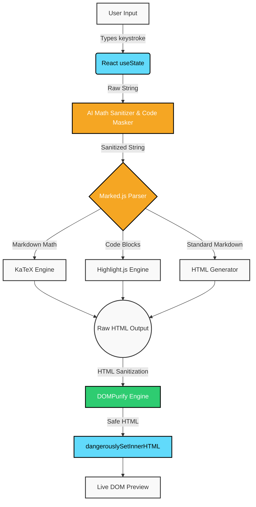

# MARKDOWN LATEX PDF GENERATOR
*A minimal web app to preview Markdown and LaTeX math instantly.*

**Project:01**
_March 2026_

### Live demo: [Markdown Latex Pdf](https://markdown-pdf-self.vercel.app/)
---

### Dev.to article: [Stop Fighting AI Formatting: How I Built a "Sanitizer" for Messy AI Markdown](https://dev.to/suryansh_swarn/stop-fighting-ai-formatting-how-i-built-a-sanitizer-for-messy-ai-markdown-3ooh)

> This project is developed throughout march 2026 to achieve practical fluency, increase my learning and getting comfortable with the framework and language also i am writing every update i have done with dates in this webapp.

### Tech stack 
_`React` `Vite` `marked.js` `highlight.js` `KaTeX` `DOMPurify`_

---
### Features:

* **Live Rendering:** Real-time Markdown and KaTeX math preview.
* **Code Highlighting:** Automatic syntax color-coding via Highlight.js.
* **AI Auto-Formatter:** Safely sanitizes AI-generated LaTeX math delimiters (`\[...\]` and `\(...\)`) while preserving code blocks, inline code, and JSON structures.
* **XSS Defense:** Full DOMPurify sanitization pipeline securing rendered preview output.
* **Smart Toolbar:** One-click insertion for formatting, code blocks, and equations.
* **PDF Export:** Optimized `@media print` stylesheets for clean document saving.
* **Liquid Glass UI:** Responsive, Apple-inspired frosted glass aesthetic with Light/Dark modes.
* **PWA:** _`10 May 26`_ Look at the far right side of the URL address bar. You should now see a little screen icon with a down arrow. If you hover over it, it will say "Install markdown-pdf".

---

> Funcfact: this readme file is also edited first on the [markdown-pdf](https://url.com) webapp after that i pasted the result in vscode.

---

### Flow:

